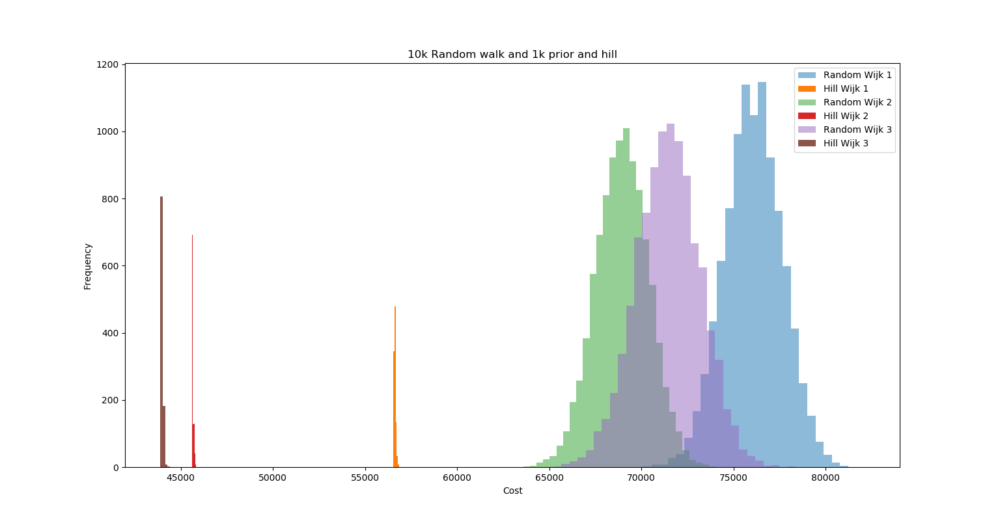
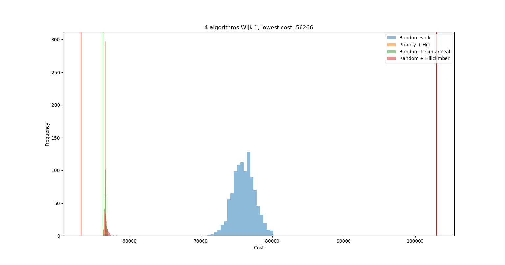
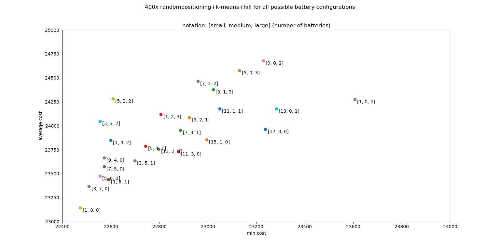

# blauw.smartgrid
Smart grid project van groep blauw: Thomas Reus, Daan Molleman en Harmke Vliek

# Description
The git is separated into two folders. The first one is code, in which our code resides. The second one is presentation. This map contains images, powerpoints and the UML diagram that represents the data structure of the code.

# Project
The smart grid project exists of 150 houses and 5 batteries, anchored in a grid. The first phase of the project dictates a fixed location for both the houses and the batteries. All houses are in possession of some sort of green energy generator such as solar panels or windmills. The generators generate energy which has to be preserved in case the generated energy is not consumed immediately. This remaining energy is stored in one of the batteries using cable connections. The cables connecting the houses to the batteries and vice versa are constituted based on Manhattan distance, which means they cannot be set diagonally in the grid. The capacity of all batteries is limited. The first purpose of this project is connecting all the houses to the available batteries without exceeding the capacity of each battery. The second object is optimization of cable positioning which leads to the minimum amount of cable length needed to connect all houses and batteries. The third goal of this project is the minimalization of the cable length combined with the possibility of the installation of extra batteries and discover what is more beneficial; installing more batteries or developing an extensive cable network.

# Complexity
The Smart Grid problem is a complex one. To be able to calculate the state space of this problem, one needs a complexity function. The function for this specific problem is as follows: C = 𝐵^𝐻. C is complexity, B is the amount of batteries and H is the amount of houses represented in the plot. The function is the way it is because there are x batteries, which have to be connected to x amount of houses. In this case, it comes down to five batteries and 150 houses. Without allowing for capacity, each battery has 150 possible connections. Therefore, the function of this case is 5^150.

The complexity for the three given grids is similar; 5^150 = 7,01 E104. Once the third goal is reached, it is possible to add extra batteries. This means that the state space will increase, as the value of variable B will be increased.

The upper and lower bounds of this case are defined in the amount of cost of the network. To calculate the lower bound, we did not account for the capacity of the batteries. Consequently, we connected every house to the closest battery. This provides the cost of the shortest total distance a connected grid entails. The upper bound was calculated similarly, however we took the maximum distance for each house to be connected to a battery without taking into account its capacity. This provides the cost of the largest total distance a connected grid entails.
The feasibility of the bounds is dependent on the capacity of the batteries. The bigger the capacity, the more realistic it is to approach the lower bound for every grid. The real lower and upper bounds are different from the ones we calculated. The batteries do have a limited capacity, therefore the lower bound is slightly higher and the upper bound is slightly lower.

The upper and lower bound per grid are calculated including the fixed costs of the battery in the first two goals. These are rendered below.

# Bottlenecks
Finding the solutions regarding each subproblem is not without problems. The first is the capacity of each battery. As long as batteries have a maximum capacity, houses won't be connected without setting a capacity fixer. The second problem is the statespace. As the range of solutions is very big, it is difficult to find a proper one. It would take a huge amount of time to try to find the best solution. Another problem is the positioning of the batteries. In step A and B of the problem, the positions are fixed and placement is not a problem. In step C and D however, it is possible to move the batteries. This creates a problem, as there are as many possible locations for batteries as there are locations in the grid, minus the amount of houses. This amounts to 150*150 - 150 = 22350 possible battery positions. The last problem is the output of energy generated per house. As each output is different, calculations are difficult and we are not able to put in into an algorithm. The output has to be approached as an external factor.

# Code
**Constructive algorithms**

*Random*

The random algorithm connects houses to batteries at random. This gives a representation of possible solutions for the problem of grid 1. The graph has been run 10.000 times. The goal is to create algorithms that better the optimal outcome of this random walk.

The random algorithm shows the distribution of random generated solutions. These offer a benchmark to compare other algorithms to. It also answers problem set A.

*Greedy*

A greedy algorithm is an algorithmic strategy that makes the optimal choice at each small stage with the goal of this eventually leading to a global optimum. This means that the algorithm picks the best immediate output without taking future outputs into consideration. The algorithm is separated into two modes; proximity first and priority first. Both algorithms answer problem set A: connect all houses in the grid to the batteries.

*Proximity first*

The proximity first algorithm connects houses to batteries based on the distance of the house to the battery. Houses who are closest are connected before houses that are farther away.

Proximity first is a working heuristic because it suggests a solution to problem set A. By connecting the houses closest to the battery first, the cable cost decreases dramatically compared to the random solutions.

*Priority first*

The priority first algorithm connects houses to batteries based on the output of the houses. Houses whose output is high are connected before houses whose output is lower. The output differentiates from 20 to 70.

Priority first is a working heuristic because it suggests a solution to problem set A. Prioritizing houses farthest away from the second furthest battery prevents houses being connected to batteries far away because the closest battery has been filled up to it's capacity. This reduces cable length compared to the random walk and proximity first.

*A**

The A* algorithm is an algorithm that renders the shortest distance between two plots in a graph. Houses are thus connected to batteries with the shortest possible routes. This algorithm checks per house, one by one.

The algorithm answers problem set E: optimize the smart grid for all three districts, taking into account the new compensation scheme. This algorithm finds the best way to connect all houses to the batteries without putting cables under houses. This is done giving values to certain points; one step on the grid costs 9, one house costs 5000 and the batteries cost 10000 as cables can't run under or above batteries.

A* is a proper heuristic because it suggests the best way to set up a grid without increasing the cost by enduring fees because cables are situated below houses. Due to the way routes are given a value, it is possible to see whether going around houses or tunnel under them is more profitable.

.png)

**Iterative algorithms**

*Hillclimber*

A hillclimber is an algorithm that tries to find a sufficiently good solution to the problem. This solution may be a local optimal maximum instead of the global optimal maximum. The code accepts similar or better situations than the previous. If the proposed situation is not similar to or better than the last; the situation will be discarded. This will continue as long as no more than 22350 situations are better or similar to the previous circumstances, to ensure a local maximum is reached. This situation will be rendered as the solution.

The hillclimber is a possible answer to problem set B: Calculate the costs for the district configured in step A and find the best possible configuration of cables. It minimalizes cable costs by switching connections between houses and batteries and performing this until the configuration has not been bettered 22350 times. It sorts the problem of choosing the best solution out of several possible solutions.

Shown below is a line plot that represents ten runs of the hillclimber. It renders the relative quality of the solutions in regard to each other.

*Simulated annealing*

Simulated annealing is a algorithm in which worse solutions are accepted in order to escape a local maximum. This algorithm is not yet ready. It is however a continuation of the process rendered when the hillclimber algorithm runs, as it tries to escape the local maxima the hillclimber can enter.

The simulated annealing is an answer to the problem the hillclimber leaves us with. The hillclimber finds a local minimum, which is the lowest point in a certain area. The simulated annealing finds the global minimum instead of the local minimum the hillclimber finds.

*K-means*

This is an algorithm that is useful from the third goal on of this project. The K-means algorithm is a cluster algorithm. It calculates the average of all the points in a cluster and moves the centroid to that average location. This continues until there is no more change in the clusters.  

The K-means algorithm is a possible solution for problem set C: Move the batteries and try to achieve a better result. It calculates the local optimum for battery placement when the batteries are at the standard location or placed randomly.

Shown below is an plot that represents ten runs of the K-means after which the hillclimber is run. It renders the relative quality of the solutions in regard to each other. The histogram renders the cost of different possible solutions.

# Comparison
The plot beneath shows the relative quality of the random and priority first algorithms regarding each other. In the future, all other algorithms will be plotted in this graph as well.

# District comparison
The plots shown below are histograms of the 4 algorithms that are used to solve step b. Each algorithm is run a thousand times, the algorithms run are: random walk, priority first with random hillclimber, random with simulated annealing and random with hillclimber.

# Step D exploration

When we are allowed to use multiple different batteries the question arises what combination of batteries we should use. We tried tackling this problem by running several algorithms on each possible combination. The results are shown below.

The images shown above are created using matplotlib.pylot and Bokeh.

# Packages installed
To run the code, several packages need to be installed. These packages are Bokeh, Numpy and Matplotlib. These
